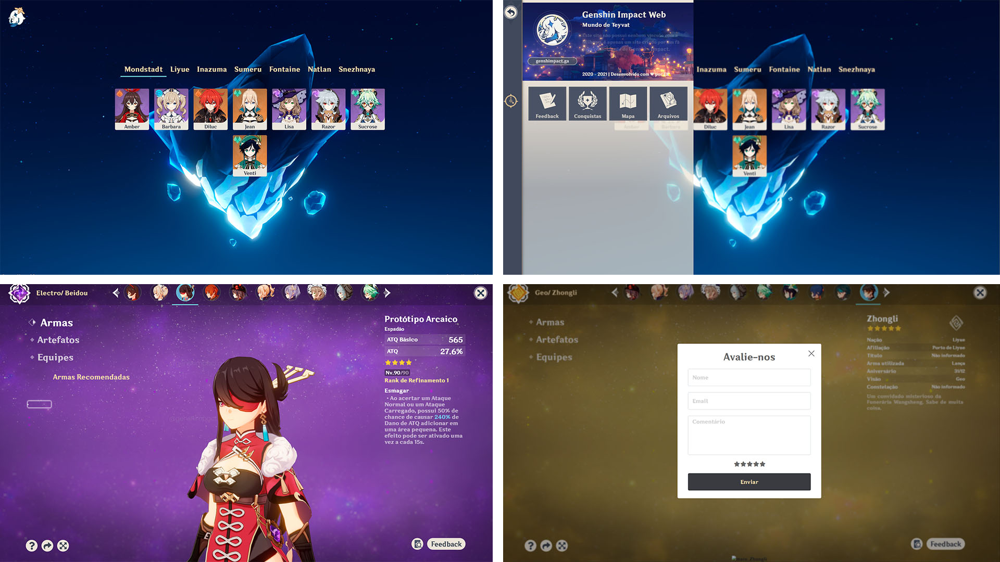
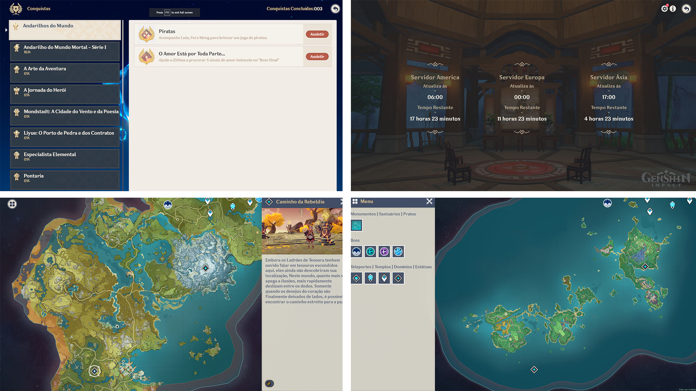
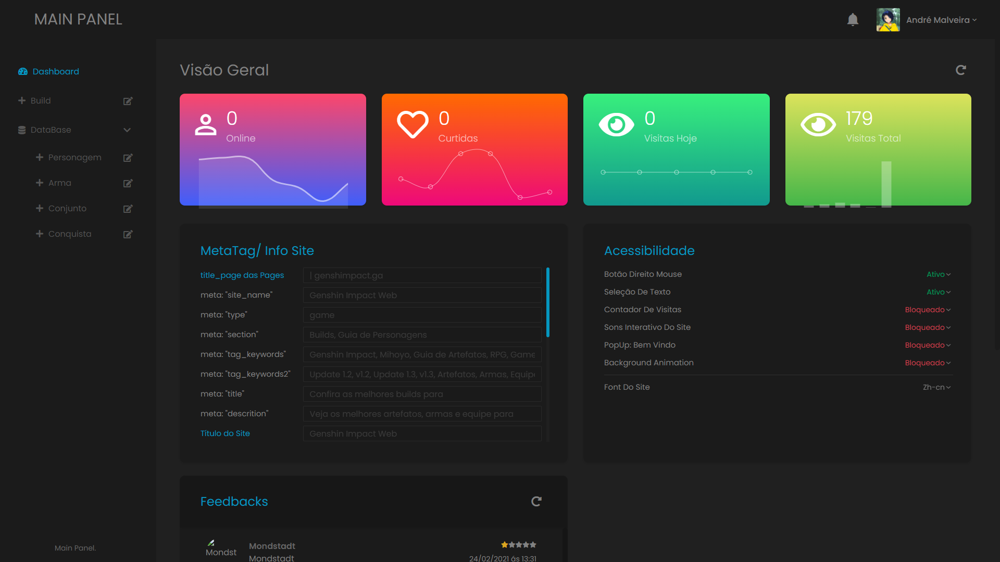
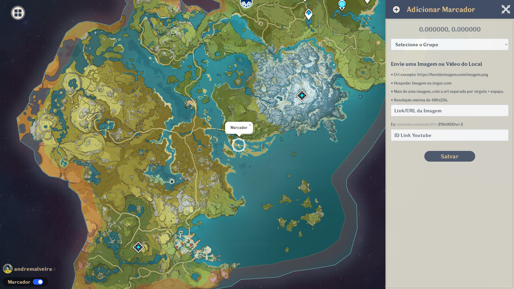

## Genshin Build [Deprecated]

Um projeto pessoal fullstack que iniciei em 2020, onde desenvolvi toda lógica Front-End e Back-End usando Javascript para interação no lado do cliente, PHP como linguagem de servidor e MYSQL para banco de dados.

Esse projeto foi desenvolvido para mostrar armas e artefatos recomendados para os personagens, vídeos de como conseguir as conquistas e mapa interativo com localização de items do game Genshin Impact.

  

  

 

## Dash
O projeto possui uma Dashboard por onde é possível adicionar personagens, armas, artefatos e vídeos de conquistas, também possui gráficos com informações de insights, configuração de algumas acessibilidades, metadados e visualização de comentários e feedbacks.

  

> Na página do mapa interativo há uma sidebar para adicionar novas localizações quando um administrador está logado.
  

  

 

## O projeto foi descontinuado! 
Olhando pra ele hoje vejo que tem muitas falhas, levando em consideração é claro, que eu estava desenvolvendo e aprendendo ao mesmo tempo, foi um dos motivos de criar esse projeto para aperfeiçoar meu aprendizado.

 
 

  Genshin Build Personal Project 2020 - developed by <a href="https://github.com/andremalveira"> andremalveira</a>

